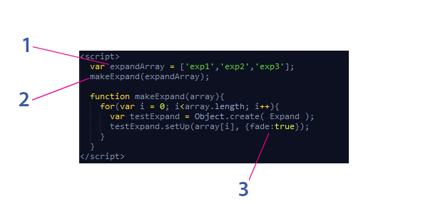

# Expand
JavaScript plugin that shrinks a div to a set height and provides a button to expand the whole div.

### Install Instructions
1. If you have multiple divs you want to expand/contract then make an array with all of the div ids

2. Call 'makeExpand' function and pass the array as an argument to the function

  - The function will loop through all of the elements in the array, and make a new 'Expand' object for each one
  
  - And it will call the 'setUp' method of the 'Expand' object. It passes the id string of the div to the 'setUp' method, as well as an options object (3 in the image).
  
3. In this image all of the options objects are the same (they all will have the 'fade' option equal to true).

